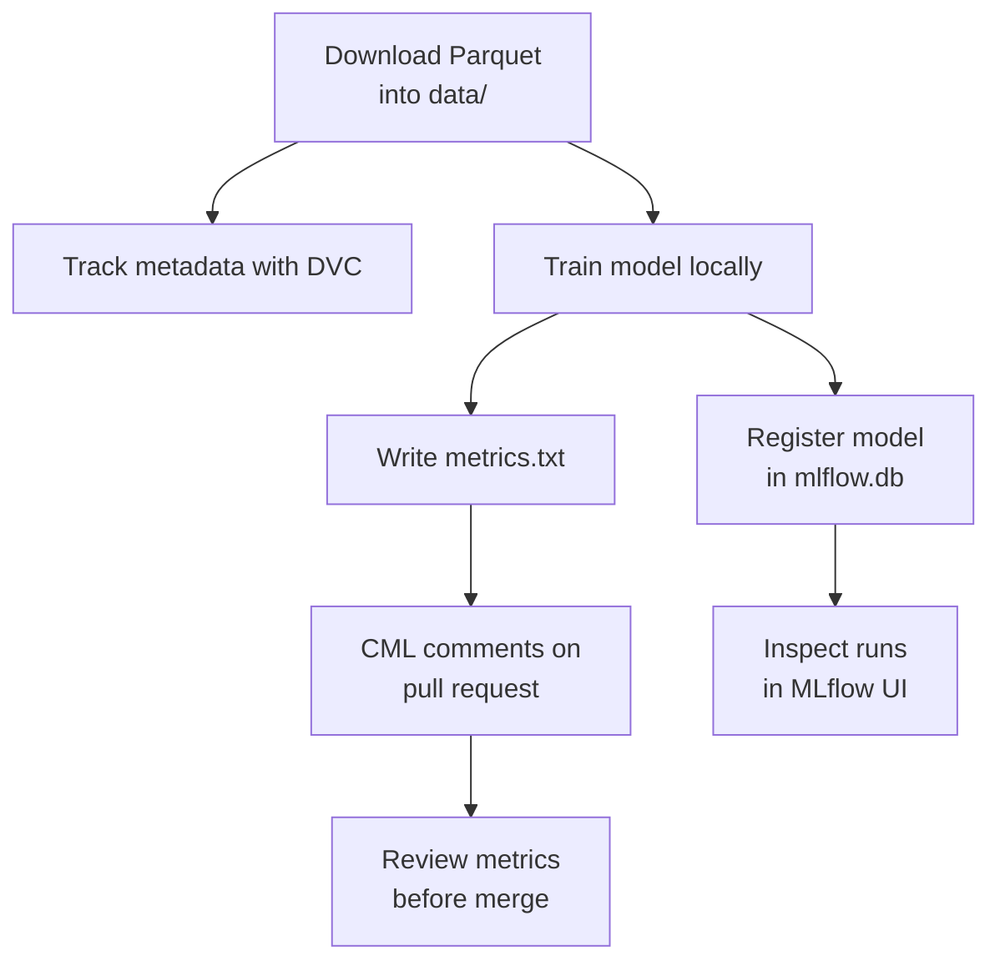

# GitHub Actions and CI/CD for Machine Learning

This repository shows how GitHub Actions, DVC, and CML fit into a small Machine Learning CI/CD workflow. The goal is to help you move from a simple pull request test to a reproducible ML workflow that tracks data with DVC, trains a model, and publishes metrics back to a pull request.

## Learning Objectives

By the end of this repository, you should be able to:

- Create a GitHub Actions workflow that runs on pull requests.
- Protect `main` with review and status check requirements.
- Use DVC metadata to version a large ML dataset without committing the data file.
- Connect DVC to a local remote directory.
- Run a CML workflow that trains a model and comments metrics on a pull request.
- Inspect local MLflow runs, metrics, tags, and registered model versions.
- Troubleshoot failed CI runs and decide whether metric changes are merge-ready.

## Learning Path

| File / Folder | Description |
| --- | --- |
| [**01 - Intro to GitHub Actions**](01-intro-github-actions.md) | Create a pull request workflow, run tests, and protect `main`. |
| [**02 - Intro to DVC**](02-intro-to-dvc.md) | Track a Green Taxi Parquet file with DVC and push it to a local DVC remote. |
| [**03 - CI/CD Workflow with CML**](03-cicd-workflow-with-cml.md) | Download data inside GitHub Actions, train the model, and post metrics with CML. |
| [**04 - MLflow Model Tracking**](04-mlflow-model-tracking.md) | Inspect local MLflow experiments, metrics, tags, and registered model versions. |
| [**05 - CI Review and Troubleshooting**](05-ci-review-and-troubleshooting.md) | Read CI logs, interpret CML comments, and decide whether a model change is merge-ready. |

### Additional Folders and Files

| File / Folder | Description |
| --- | --- |
| [**src/train.py**](src/train.py) | Script that trains the XGBoost model, logs it to MLflow, and writes `metrics.txt`. |
| [**.github/workflows/cml.yaml**](.github/workflows/cml.yaml) | GitHub Actions workflow that trains the model and comments metrics on pull requests. |
| [**data**](data/) | Local folder for the Green Taxi Parquet file. |
| [**assets**](assets/) | Visual aids referenced in the repository. |
| [**pyproject.toml**](pyproject.toml) | Project configuration and dependencies. |
| [**uv.lock**](uv.lock) | Dependency lock file. |

## Local-First

This repository is designed to run locally. The main path needs only:

- the Python 3.13 environment created by `uv sync`,
- the January 2025 Green Taxi Parquet file downloaded into `data/`,
- a local SQLite-backed MLflow store,
- an optional local DVC remote directory when practicing DVC.



## Prerequisites

- On macOS, XGBoost needs the **OpenMP** runtime. Install it with Homebrew before you run the training script:

  ```bash
  brew install libomp
  ```

> [!NOTE]
> **Windows Users:** The commands in this repository use bash syntax. Use **Git Bash** (installed with [Git for Windows](https://git-scm.com/downloads/win)) instead of PowerShell to run them.

## Setup

> [!NOTE]
> Throughout these steps, text in angle brackets like `<repo-name>` is a
> **placeholder**. Replace it including the `< >` brackets with your own
> value. For example, `cd <repo-name>` becomes `cd mle-github-actions-and-cicd`.

### 1. Create the Repository from the Template

Click **Use this template** on GitHub.

When creating the repository:

- Set yourself as the **Owner**
- Choose a repository name
- Disable **Include all branches**
- Click **Create repository**

> [!IMPORTANT]
> If you are working in pairs or groups, only **one person** should complete this step.

---

### 2. Add Collaborators (Pairs/Groups Only)

If working with teammates:

1. Open the repository on GitHub
2. Go to **Settings → Collaborators**
3. Add your teammates as collaborators
4. Share the repository link with your team

Teammates should accept the invitation before continuing.

---

### 3. Clone the Repository

Copy the SSH URL from the **Code** button on GitHub, then run:

```bash
git clone <copied-ssh-url>
```

The copied SSH URL will look like `git@github.com:<your-username>/<repo-name>.git`.

---

### 4. Move into the Project Folder and Install Dependencies

This installs all dependencies and creates a virtual environment in `.venv/`.

```bash
cd <repo-name>
uv sync
```

---

### 5. Open the Repository in VS Code

> [!NOTE]
> Make sure you open VS Code from the project root so it automatically detects the environment created by `uv sync`.

Launch VS Code in the project root folder:

```bash
code .
```

Every command in the walkthrough runs through `uv run`, so this environment is used automatically.

## Cleanup

To remove the training and MLflow outputs but keep the downloaded data and your DVC setup, run this from the project root:

```bash
rm -rf mlruns mlartifacts
rm -f mlflow.db mlflow.db-shm mlflow.db-wal metrics.txt report.md
```

To fully reset the repository, also remove the data, the DVC files, and the local DVC remote:

```bash
rm -rf data .dvc .dvcignore ../dvc-local-remote
mkdir data
touch data/.gitkeep
```

If you committed the DVC files in lesson 2, commit their removal before you start again:

```bash
git add .dvc .dvcignore data
git commit -m "Reset DVC exercise"
```

> [!CAUTION]
> These commands permanently delete your local MLflow runs, registered model versions, and DVC remote. Run them from the project root only.

## References & Further Reading

- [**GitHub Actions Docs**](https://docs.github.com/en/actions): Official guide to workflows, jobs, and runners.
- [**Using uv in GitHub Actions**](https://docs.astral.sh/uv/guides/integration/github/): How the workflow installs dependencies with `setup-uv`.
- [**About Protected Branches**](https://docs.github.com/en/repositories/configuring-branches-and-merges-in-your-repository/managing-protected-branches/about-protected-branches): How branch protection rules and required status checks work.
- [**DVC Docs**](https://dvc.org/doc): Data versioning, remotes, and pipelines.
- [**CML Docs**](https://cml.dev/doc): Reporting ML results on pull requests.
